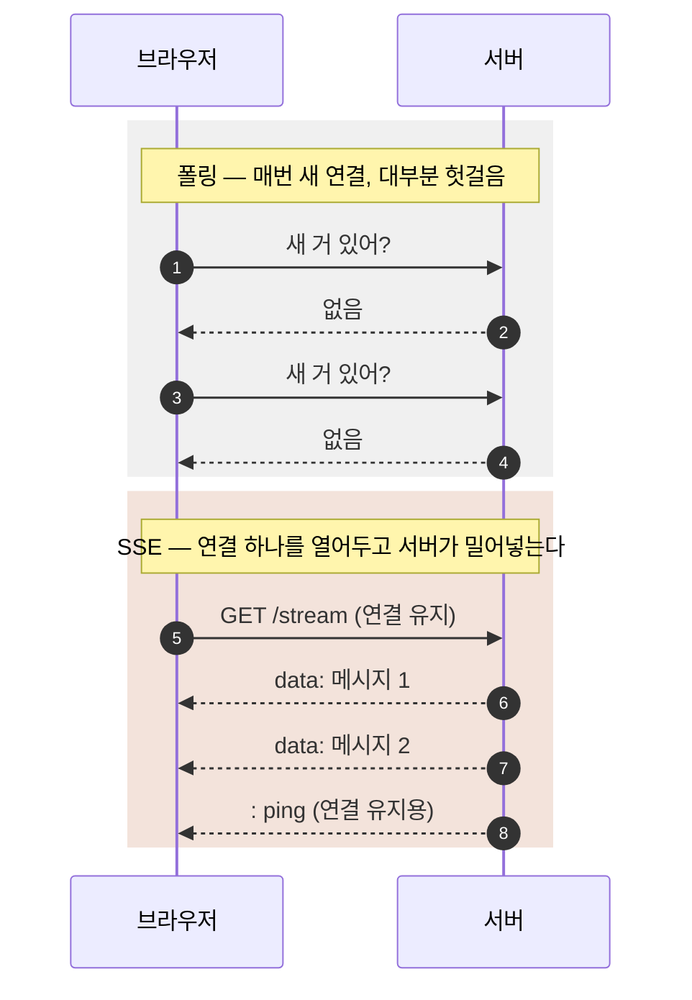
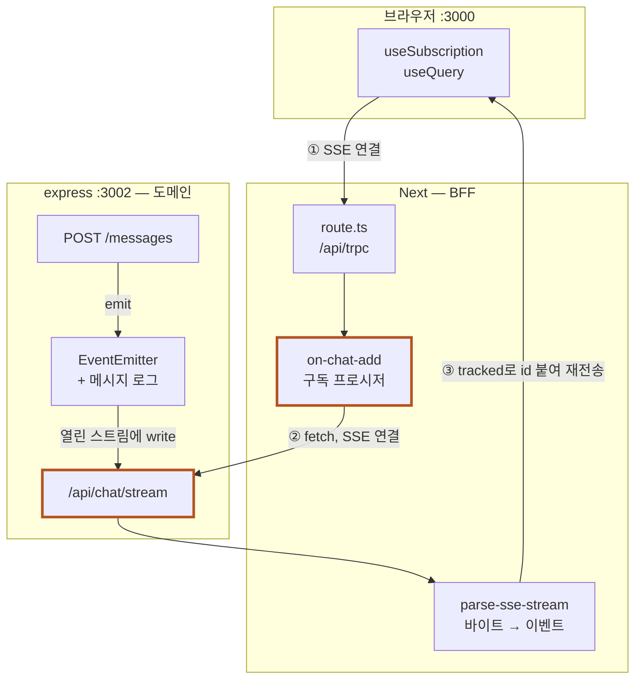
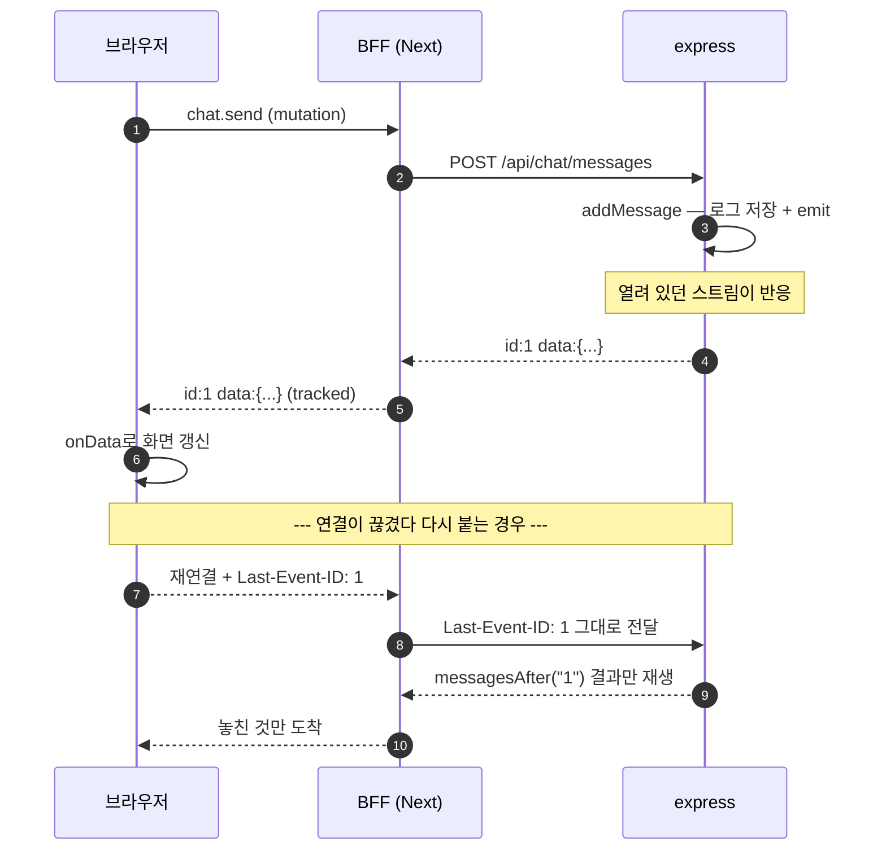

# tRPC SSE 코드 읽기

Next.js를 BFF로 두고 express 도메인 서버의 SSE 스트림을 중계하는 구조.
SSE 개념부터 시작해 파일 12개를 읽는 순서대로 짚는다.

- 브랜치: `feat/trpc-sse`
- 관련 커밋: `fa194f9` (SSE 세팅) · `3bc92d2` (구조 정리) · `b828d63` (포맷)
- tRPC v11.18

---

## 목차

**개념**

- [SSE가 뭔가](#sse가-뭔가)
- [프레임은 그냥 텍스트다](#프레임은-그냥-텍스트다)
- [네트워크에서는 이렇게 보인다](#네트워크에서는-이렇게-보인다)
- [이 프로젝트의 구조](#이-프로젝트의-구조)

**코드** — 아래에서 위로 읽는다

| # | 파일 | 계층 | 내용 |
| --- | --- | --- | --- |
| 01 | `express/src/events.ts` | domain | 이벤트가 태어나는 곳. 메시지 로그를 남기는 이유 |
| 02 | `express/src/index.ts` | domain | SSE 원본 스트림. 프레임 형식과 연결 정리 |
| 03 | `core/api/client.ts` | bff | BFF가 express를 부르는 유일한 통로 |
| 04 | `core/trpc/utils/parse-sse-stream.ts` | bff | 바이트를 이벤트로 자른다. 청크 경계 문제 |
| 05 | `core/trpc/server/base/init.ts` | bff | tRPC 인스턴스 생성. SSE ping 설정 |
| 06 | `core/trpc/server/middleware/` | bff | logging · error · auth 3종 |
| 07 | `core/trpc/client/procedures.ts` | bff | public / protected 조립 |
| 08 | `domain/chat/procedures/on-chat-add/` | bff | **핵심.** 중계가 실제로 일어나는 27줄 |
| 09 | `core/trpc/routers/_app.ts` | bff | 라우터 조합. 타입이 클라이언트로 건너가는 지점 |
| 10 | `app/api/trpc/[trpc]/route.ts` | bff | HTTP 진입점. 세 줄의 런타임 설정 |
| 11 | `providers/query-client-provider.tsx` | client | splitLink. 여기 틀리면 조용히 실패한다 |
| 12 | `domain/chat/hooks/use-chat-messages.ts` | client | query와 subscription을 합치는 곳 |

**마무리**

- [tRPC 없이 짰다면](#trpc-없이-짰다면)
- [확인한 것과 안 한 것](#확인한-것과-안-한-것)
- [프로덕션 전에 손봐야 할 것](#프로덕션-전에-손봐야-할-것)

---

# 개념

## SSE가 뭔가

한 줄로 줄이면 — **서버가 클라이언트에게 일방적으로, 여러 번 데이터를 보내는 HTTP**.

보통 HTTP는 요청 하나에 응답 하나로 끝난다. 브라우저가 물어보면 서버가 답하고 연결이 닫힌다. 그래서 **서버 쪽에서 뭔가 생겼을 때 먼저 알려줄 방법이 없다.** 새 알림, 새 채팅, 진행률 같은 것들이다.

이 문제를 푸는 방식은 크게 셋이다.

| 방식 | 방향 | 특징 |
| --- | --- | --- |
| 폴링 | 클라 → 서버 반복 질문 | 구현은 제일 쉽지만 대부분의 요청이 "없다"는 답만 받아온다. 새 데이터를 받기까지 폴링 주기만큼 밀린다 |
| **SSE** | 서버 → 클라 단방향 | 연결을 한 번 열어두고 서버가 밀어넣는다. 평범한 HTTP라 프록시·방화벽을 그대로 통과하고, 끊기면 브라우저가 알아서 다시 붙는다 |
| WebSocket | 양방향 | 둘 다 아무 때나 말할 수 있다. 대신 HTTP가 아닌 별도 프로토콜로 업그레이드돼서 인프라 설정이 따로 필요하다 |



이 프로젝트는 **서버가 새 채팅을 알려주기만** 하면 된다. 클라이언트가 보낼 때는 그냥 POST를 쓰면 되니 양방향이 필요 없고, 평범한 HTTP라는 점이 이득이다.

> **기억할 것** — SSE는 "닫지 않는 GET 응답"이다. 그 이상의 마법은 없다.

## 프레임은 그냥 텍스트다

특별한 바이너리 프로토콜일 것 같지만, 실제로는 **약속된 형식의 평문**이 계속 흘러올 뿐이다.

```
id: 3
event: chat
data: {"id":"3","text":"안녕"}
                              ← 빈 줄 = "이벤트 하나 끝" 신호

: ping                        ← 콜론으로 시작하면 주석. 무시된다
```

규칙은 이게 전부다. `키: 값` 줄이 이어지다가 **빈 줄이 나오면 한 이벤트가 끝난 것**으로 본다.

| 필드 | 역할 |
| --- | --- |
| `id:` | 이벤트 번호. 재연결 복구에 쓰인다 |
| `event:` | 이벤트 이름. 생략하면 `message`가 된다 |
| `data:` | 실제 내용 |
| `retry:` | 재연결 대기 시간(ms) 지정 |
| `:` | 주석. 클라이언트가 무시한다 |

`id:` 줄이 있으면 브라우저가 마지막으로 받은 번호를 기억해뒀다가, **재연결할 때 `Last-Event-ID` 헤더에 실어 보낸다.** 이 자동 동작이 나중에 08번의 `tracked()`와 이어진다.

> **기억할 것** — 빈 줄이 이벤트 구분자. `id:` 줄이 재연결 복구의 씨앗.

## 네트워크에서는 이렇게 보인다

개념만으로는 디버깅할 때 막힌다. 아래는 이 프로젝트를 띄워놓고 `curl -v`로 **실제 캡처한** 내용이다.

### 최초 연결

구독을 시작하면 그냥 **평범한 GET 요청**이 나간다. 특별한 핸드셰이크가 없다. 다른 점은 `Accept` 헤더 하나뿐이다.

```http
GET /api/chat/stream HTTP/1.1
Host: localhost:3002
User-Agent: curl/8.7.1
Accept: text/event-stream        ← "나 SSE로 받을게"
                                 ← 빈 줄 (헤더 끝)
```

서버 응답 헤더는 이렇게 온다.

```http
HTTP/1.1 200 OK
X-Powered-By: Express
Content-Type: text/event-stream       ← 이게 SSE 선언
Cache-Control: no-cache, no-transform ← 캐시·변형 금지
Connection: keep-alive
X-Accel-Buffering: no                 ← 프록시 버퍼링 끄기
Date: Sat, 29 Aug 2026 01:13:08 GMT
Transfer-Encoding: chunked            ← 길이를 모르니 청크로
                                      ← 빈 줄, 여기부터 바디가 끝없이 이어진다
```

**`Content-Length`가 없다.** 일반 응답은 "몇 바이트짜리"인지 알려주고 끝내지만, SSE는 얼마나 보낼지 서버도 모른다. 그래서 `Transfer-Encoding: chunked`로 전환되고 연결이 닫힐 때까지 청크가 계속 추가된다. 이 헤더는 우리가 안 썼는데 Node가 알아서 붙인다.

### 바디는 조금씩 나눠서 도착한다

응답 헤더를 받은 뒤 **바디가 열린 채로 남아있고**, 이벤트가 생길 때마다 조각이 추가된다. 아래는 `cat -e`로 줄 끝(`$`)을 드러낸 실제 바이트다.

```
id: 3$
data: {"id":"3","author":"alice","text":"메시지 1",...}$
$                                    ← 빈 줄 = 이벤트 1 끝
id: 4$
data: {"id":"4","author":"alice","text":"메시지 2",...}$
$                                    ← 빈 줄 = 이벤트 2 끝
```

`$`가 `\n`이다. 이벤트마다 **`\n\n`(빈 줄)으로 끝나는 것**이 눈에 보인다. 04번 파서가 `buffer.split("\n\n")`으로 자르는 게 바로 이 경계다.

> 연결 직후에는 **0바이트**가 온다. express는 이벤트가 생겨야 비로소 뭔가를 쓴다. `curl`로 열어놓고 가만히 있으면 아무것도 안 뜨는 게 정상이다 — 고장이 아니다.

### Last-Event-ID가 실제로 들어오는 모습

연결이 끊기면 브라우저가 **자동으로** 다시 붙는다. 이때 마지막으로 받은 `id:` 값을 헤더에 실어 보낸다. 아래는 id 3까지 받은 상태에서 재연결한 실제 요청이다.

```http
GET /api/chat/stream HTTP/1.1
Host: localhost:3002
User-Agent: curl/8.7.1
Accept: text/event-stream
Last-Event-ID: 3                 ← 브라우저가 자동으로 붙인다
```

서버는 이 값을 보고 **4번부터** 되돌려준다. 3번은 이미 받았으니 다시 보내지 않는다.

```
id: 4$
data: {"id":"4","author":"alice","text":"메시지 2",...}$
$
(3번은 오지 않는다 — 이미 받았으므로)
```

express가 이 헤더를 읽는 코드는 이렇다.

```ts
const lastEventId = (req.headers["last-event-id"] ??
  req.query.lastEventId) as string | undefined;

if (lastEventId) {
  for (const message of messagesAfter(lastEventId)) {   // "3번 다음부터"
    res.write(`id: ${message.id}\ndata: ${JSON.stringify(message)}\n\n`);
  }
}
```

> **헤더 이름 주의** — Node는 요청 헤더 키를 **전부 소문자로** 정규화한다. 네트워크에는 `Last-Event-ID`로 흐르지만 코드에서는 `req.headers["last-event-id"]`로 읽어야 한다. 대문자로 찾으면 `undefined`가 나온다.

### 재연결은 언제 일어나나

| 상황 | 동작 |
| --- | --- |
| 네트워크 끊김 · 서버가 연결 종료 | **자동 재연결** + `Last-Event-ID` 전송 |
| 서버가 `retry: 5000` 전송 | 재연결 대기 시간을 5초로 바꾼다 |
| 클라이언트가 명시적으로 닫음 (`EventSource.close()`) | 재연결 안 함. 완전 종료 |
| 응답이 200이 아니거나 Content-Type 불일치 | 재연결 안 함. `onerror` 후 종료 |

**4xx·5xx를 받으면 재시도하지 않는다.** 인증 만료로 401이 떨어지면 구독이 조용히 죽으므로, 토큰 갱신 후 직접 다시 열어줘야 한다.

### BFF를 거치면 프레임이 한 번 더 감싸진다

같은 요청을 express가 아니라 **BFF(:3000)** 로 보내면 tRPC가 자체 프레임을 얹는다. 아래도 실제 캡처다.

```
HTTP/1.1 200 OK
vary: trpc-accept, accept
content-type: text/event-stream
x-accel-buffering: no
Transfer-Encoding: chunked

event: connected                             ← tRPC가 즉시 보내는 인사
data: {"reconnectAfterInactivityMs":10000}   ← 클라 설정 전달

event: ping                                  ← keepalive (3초마다)
data:

data: {"id":"4","author":"alice","text":"메시지 2",...}
id: 4                                        ← tracked()가 붙인 id
```

express 원본과 비교하면 세 가지가 다르다.

- **연결 즉시 `event: connected`** 가 온다. "10초간 조용하면 재연결하라"는 설정을 실어 보낸다.
- **`event: ping`** 이 3초마다 온다. express는 `: ping` 주석을 썼는데 tRPC는 이름 있는 이벤트로 보낸다. 목적은 같다.
- **`data:`가 `id:`보다 먼저** 나온다. express는 `id:`를 먼저 썼다. SSE 스펙상 **필드 순서는 상관없어서** 둘 다 정상이다.

### 직접 확인하기

```bash
# 헤더까지 다 보기
curl -v -N -H "Accept: text/event-stream" localhost:3002/api/chat/stream

# 재연결 흉내 — id 3 이후만 요청
curl -N -H "Last-Event-ID: 3" localhost:3002/api/chat/stream

# 개행을 눈으로 확인
curl -N localhost:3002/api/chat/stream | cat -e
```

브라우저 개발자 도구에서는 Network 탭 → 해당 요청 → **EventStream** 패널에서 파싱된 이벤트 목록을 볼 수 있다.

> **기억할 것** — 평범한 GET에 Accept 하나. 재연결은 `Last-Event-ID` 헤더로 들어온다.

## 이 프로젝트의 구조

여기에 **BFF 한 겹**이 더 들어간다. 브라우저가 express에 직접 붙지 않고 Next를 거친다. 그래서 **SSE 연결이 두 개**가 된다 — 이게 이 코드베이스를 이해하는 가장 중요한 사실이다.



연결이 둘이라 **같은 일을 두 번 해야 하는 것들**이 생긴다. keepalive ping도 두 군데(express의 `setInterval`, tRPC의 `sse.ping` 설정), 연결 정리도 두 군데서 챙겨야 한다. 읽다가 "이거 아까 본 것 같은데" 싶으면 대개 이 이유다.

### 메시지 하나가 지나가는 길



> **기억할 것** — 연결이 두 개. 그래서 ping도 정리도 두 번 나온다.

---

# 코드

**아래에서 위로** 읽는다. 데이터가 태어나는 express부터 시작해 브라우저 화면까지 올라간다. 반대로 읽으면 "이 값이 어디서 왔지"를 계속 되짚어야 해서 잘 안 남는다.

## 01 · 이벤트가 태어나는 곳

`apps/express/src/events.ts`

앞 그림의 맨 아래, express 안쪽에 있던 **EventEmitter + 메시지 로그**가 이 파일이다. "새 메시지가 생겼다"는 사실을 다른 코드에 알리는 역할이고, 40줄짜리 작은 파일인데 여기서 정한 두 가지가 뒤쪽 전부를 결정한다.

express는 요청 하나에 응답 하나를 주고 끝나는 구조다. 그런데 SSE는 **이미 열려 있는 연결에 나중에 데이터를 밀어넣어야** 한다. POST로 들어온 메시지를, 전혀 다른 요청으로 열려 있는 스트림에 전달할 방법이 필요하다. 그래서 Node의 `EventEmitter`를 중간에 둔다.

```ts
// 타입이 붙은 이벤트 버스 — emit/on 오타를 컴파일 시점에 잡는다
type AppEvents = { "chat:add": [ChatMessage] };
class TypedEmitter extends EventEmitter<AppEvents> {}
export const ee = new TypedEmitter();

export function addMessage(author: string, text: string): ChatMessage {
  seq += 1;
  const message = { id: String(seq), author, text, createdAt: ... };

  messageLog.push(message);       // ① 로그에 쌓고
  ee.emit("chat:add", message);   // ② 열려 있는 스트림들에 알린다

  return message;
}
```

### 왜 로그(messageLog)까지 남기나

단순히 알리기만 할 거면 `ee.emit` 한 줄이면 된다. 배열에 `push`까지 하는 건 **재연결 복구** 때문이다.

예를 들면 지하철에서 터널에 들어가 3초간 끊겼다고 하자. 그 사이 메시지 2개가 지나갔다면 emit은 이미 끝나버려서 되돌릴 방법이 없다. 로그가 있으면 `messagesAfter("5")`로 **"5번 다음에 온 것들"** 을 다시 꺼낼 수 있다. 이 함수가 08번의 `lastEventId`와 이어진다.

```ts
export function messagesAfter(lastEventId: string): ChatMessage[] {
  const index = messageLog.findIndex((m) => m.id === lastEventId);
  // 못 찾으면 빈 배열 — 너무 오래된 id를 들고 온 경우
  return index === -1 ? [] : messageLog.slice(index + 1);
}
```

id를 `seq` 증가로 만드는 것도 같은 이유다. 랜덤 UUID면 "이 id 다음"이라는 순서 개념이 성립하지 않는다.

> **데모용** — 이 버스는 프로세스 안에서만 동작한다. 서버를 2대로 늘리면 A서버에서 emit한 이벤트가 B서버에 붙은 구독자에게 안 간다. 실서비스라면 Redis pub/sub 같은 외부 브로커로 바꿔야 한다.

> **기억할 것** — emit은 "지금 듣는 사람"에게만 간다. 그래서 로그를 따로 남긴다.

## 02 · SSE 원본 스트림

`apps/express/src/index.ts` — `/api/chat/stream`

**앞서 만든 이벤트를 HTTP 응답으로 흘려보내는** 곳이다. 이 파일은 tRPC를 전혀 모른다 — 그냥 express다.

일반 라우트와 결정적으로 다른 점은 **`res.end()`를 부르지 않는다**는 것이다. 응답을 열어둔 채로 두고, 이벤트가 생길 때마다 `res.write()`로 조금씩 밀어넣는다.

```ts
app.get("/api/chat/stream", (req, res) => {
  res.writeHead(200, {
    "Content-Type": "text/event-stream",
    "Cache-Control": "no-cache, no-transform",
    Connection: "keep-alive",
    "X-Accel-Buffering": "no",   // nginx 버퍼링 방지
  });

  // (lastEventId 처리 — 위 네트워크 절 참고)

  const onAdd = (message) => {
    res.write(`id: ${message.id}\ndata: ${JSON.stringify(message)}\n\n`);
  };
  ee.on("chat:add", onAdd);

  const ping = setInterval(() => res.write(": ping\n\n"), 15_000);

  req.on("close", () => {     // ★ 이거 빼먹으면 서버가 죽는다
    clearInterval(ping);
    ee.off("chat:add", onAdd);
    res.end();
  });
});
```

> **가장 흔한 사고** — `req.on("close")`를 안 쓰면 탭을 닫을 때마다 `ee`에 리스너가 하나씩 영구히 쌓인다. 100명이 들락날락하면 리스너 100개가 이미 끊긴 응답에 `write`를 시도한다. 메모리 누수 + `MaxListenersExceededWarning`으로 이어진다.

`X-Accel-Buffering: no`가 없으면 nginx 같은 프록시가 "응답이 다 모이면 한 번에 보내야지" 하고 붙들고 있는다. 그러면 실시간이 아니라 연결이 끝날 때 우르르 도착한다. **로컬에선 멀쩡한데 배포하면 안 되는** 전형적인 원인이다.

> **기억할 것** — 응답을 안 닫는 대신, 끊길 때 치우는 책임이 생긴다.

## 03 · BFF가 express를 부르는 통로

`apps/next/src/core/api/client.ts`

여기서 층이 바뀐다. 이제부터는 Next 쪽 코드고, 이 파일은 **BFF가 express와 통신하는 유일한 창구**다. allra-front가 axios `client`를 `core/api`에 두는 것과 같은 자리다.

창구를 하나로 모으는 이유는 **base URL·인증 헤더·캐시 정책을 한 곳에서만 정하기 위해서**다. 프로시저마다 `fetch`를 직접 쓰면 나중에 인증 방식이 바뀔 때 전부 찾아다녀야 한다.

함수는 두 개인데, **나뉜 이유가 중요하다.** SSE에 `request()`를 쓰면 **영원히 멈춘다.** `response.json()`은 응답이 끝날 때까지 기다리는데, SSE 응답은 끝나지 않기 때문이다.

```ts
// 스트림용 — 파싱하지 않고 ReadableStream 그대로 넘긴다
export const requestStream = async ({ path, lastEventId, signal }) => {
  const response = await fetch(`${DOWNSTREAM_URL}${path}`, {
    headers: {
      Accept: "text/event-stream",
      ...(lastEventId ? { "Last-Event-ID": lastEventId } : {}),
    },
    signal,
  });
  if (!response.body) throw new Error(`Downstream ${path} returned no body`);
  return response.body;   // 파싱은 04번에 맡긴다
};
```

`signal`을 받아 넘기는 게 핵심이다. 이 신호가 끊기면 `fetch`가 취소되고 → express의 `req.on("close")`가 발화하고 → 02번의 리스너 정리가 실행된다. **브라우저 탭을 닫으면 express의 리스너까지 정리되는 사슬**이 여기서 이어진다.

`request()` 쪽에는 `cache: "no-store"`를 박아뒀다. Next의 fetch는 기본적으로 캐싱을 시도하는데, BFF는 항상 최신 도메인 상태를 봐야 한다.

> **기억할 것** — 끝나는 응답과 끝나지 않는 응답은 다루는 법이 다르다.

## 04 · 바이트를 이벤트로 자른다

`apps/next/src/core/trpc/utils/parse-sse-stream.ts`

03번이 넘긴 `ReadableStream`은 그냥 바이트 덩어리다. 이 파일은 그걸 **`{ id, data }` 객체로 잘라주는** 역할을 한다.

브라우저에는 이 일을 해주는 `EventSource`가 내장돼 있다. 그런데 **서버(Node)에는 없다.** BFF는 서버에서 express의 SSE를 받아야 하니, 브라우저가 공짜로 해주던 파싱을 직접 써야 한다. 순수 SSE(브라우저 직결)로 갔다면 이 파일 자체가 필요 없었다.

### 왜 단순히 줄 단위로 못 자르나

네트워크는 **청크 경계와 이벤트 경계가 일치하지 않는다.**

```
청크 1로 도착:  'id: 1\ndata: {"id":"1","te'
청크 2로 도착:  'xt":"안녕"}\n\nid: 2\ndata: ...'
→ 청크 1만 보고 JSON.parse 하면 깨진다
```

해법은 버퍼에 계속 이어붙이고 **마지막 조각은 남겨두는** 것이다.

```ts
buffer += decoder.decode(value, { stream: true });

const frames = buffer.split("\n\n");
buffer = frames.pop() ?? "";   // ★ pop으로 미완성 조각을 되돌려 보관

for (const frame of frames) {  // 완성된 것만 처리
  const event = parseFrame<T>(frame);
  if (event) yield event;
}
```

`split`의 마지막 원소는 **항상 미완성일 가능성**이 있다. 빈 줄로 끝났으면 빈 문자열이라 버려도 무해하고, 잘렸으면 다음 청크와 이어붙여야 한다. `decode(value, { stream: true })`도 같은 맥락으로, 한글이 바이트 중간에서 잘리는 걸 알아서 처리해 준다.

`parseFrame`은 `:`로 시작하는 ping을 건너뛰고, JSON 파싱이 실패하면 `null`을 돌려준다. **깨진 프레임 하나 때문에 스트림 전체가 죽는 걸** 막으려는 것이다.

> **기억할 것** — 스트림 파싱은 "덜 온 것"을 다음 차례로 미루는 게 전부다.

## 05 · tRPC 인스턴스 만들기

`apps/next/src/core/trpc/server/base/init.ts`

**tRPC 인스턴스를 딱 한 번 만들고, 거기서 나온 도구들을 내보내는** 곳이다.

```ts
const t = initTRPC.context<TRPCContext>().create({ sse: { ... } });

export const createTRPCRouter = t.router;
export const createTRPCMiddleware = t.middleware;
export const createTRPCProcedure = t.procedure;
```

`t`를 직접 export하지 않고 **이름을 붙여 쪼개서** 내보내는 게 allra-front 컨벤션이다. 다른 파일에서 `t.router` 같은 축약된 이름을 보면 이게 tRPC 건지 알기 어렵기 때문이다.

### SSE 옵션 — 이 프로젝트에서 추가한 부분

```ts
sse: {
  ping: { enabled: true, intervalMs: 3_000 },
  client: { reconnectAfterInactivityMs: 10_000 },
}
```

`ping`은 02번에서 express에 직접 짰던 keepalive와 같은 일을, 이번엔 **BFF→브라우저 구간**에서 tRPC가 대신 해주는 것이다. 연결이 두 개니까 keepalive도 두 군데 필요하다.

`reconnectAfterInactivityMs`는 **서버가 클라이언트에게 주는 지시**다. "10초 동안 아무것도 안 오면 죽은 걸로 보고 다시 붙어라"는 뜻으로, 앞 네트워크 절에서 본 `event: connected` 프레임에 실려 나간다.

### context — 토큰을 두 군데서 찾는 이유

`createTRPCContext`는 `Authorization` 헤더와 **쿼리스트링** 둘 다에서 토큰을 찾는다. 브라우저 `EventSource`는 **커스텀 헤더를 실을 수 없기** 때문이다. `fetch`와 달리 API에 그런 옵션이 없다. 이건 tRPC 문제가 아니라 SSE 자체의 제약이라, 순수 SSE로 짜도 똑같이 겪는다.

> **기억할 것** — 연결이 두 개니 keepalive도 두 개. 헤더 못 싣는 건 SSE의 숙명.

## 06 · 미들웨어 3종

`apps/next/src/core/trpc/server/middleware/`

express의 `app.use(...)`와 같은 개념이다. 다만 **프로시저 단위로 골라 붙인다**는 점이 다르다.

| 파일 | 하는 일 |
| --- | --- |
| `logging` | 실패한 호출의 path·type·duration·code를 찍는다. 구독이 안 올 때 **BFF까지는 왔는지** 확인하는 용도 |
| `error` | 정체불명 예외를 `TRPCError`로 감싼다. 안 하면 `fetch` 실패 같은 게 클라이언트에 스택 트레이스째 노출될 수 있다 |
| `auth` | 토큰이 없으면 `UNAUTHORIZED`를 던지고, 있으면 **컨텍스트를 좁혀서** 넘긴다 |

```ts
export const authMiddleware = createTRPCMiddleware(async ({ ctx, next }) => {
  const token = ctx.getToken();
  if (!token) throw new TRPCError({ code: "UNAUTHORIZED" });

  // 이후 프로시저에서 token이 확실히 존재하도록 좁혀서 넘긴다
  return next({ ctx: { ...ctx, token } });
});
```

`next()`에 새 `ctx`를 넘기면 **그 뒤 프로시저의 타입이 바뀐다.** `protectedProcedure`로 만든 프로시저 안에서는 `ctx.token`이 `string | undefined`가 아니라 `string`으로 잡힌다.

> **미완성** — allra-front는 여기에 axios `isAxiosError` 분기와 Zod issue 압축 로직이 들어있다. 이 레포엔 그 의존성이 없어 뼈대만 옮겼다.

> **기억할 것** — 미들웨어가 컨텍스트를 좁히면, 그 뒤 코드의 타입이 달라진다.

## 07 · 프로시저 조립

`apps/next/src/core/trpc/client/procedures.ts`

06번의 미들웨어를 조합해 **실제로 갖다 쓸 두 가지 프로시저**를 만든다. 13줄뿐이지만 앞으로 모든 API가 이 둘 중 하나로 시작한다.

```ts
export const publicProcedure = createTRPCProcedure
  .use(loggingMiddleware)
  .use(errorMiddleware);

export const protectedProcedure = createTRPCProcedure
  .use(loggingMiddleware)
  .use(errorMiddleware)
  .use(authMiddleware);   // ← 이 한 줄만 차이
```

순서가 의미를 갖는다. `logging`이 가장 바깥이라 **인증 실패도 로그에 남고**, `auth`가 가장 안쪽이라 인증을 통과한 뒤에야 실제 로직이 돈다.

> **헷갈리는 지점** — 이 파일이 `client/` 폴더에 있지만 **서버 코드다.** allra-front 구조를 그대로 따른 결과인데, 여기서 `client`는 "브라우저"가 아니라 **"tRPC를 쓰는 쪽"** 이라는 뜻으로 읽으면 된다.

> **기억할 것** — 모든 API는 public이냐 protected냐로 시작한다. 차이는 한 줄.

## 08 · 중계가 일어나는 27줄

`apps/next/src/domain/chat/procedures/on-chat-add/`

**이 문서에서 제일 중요한 파일이다.** 앞의 01~07번이 전부 여기서 만난다.

```ts
export const onChatAddProcedure = publicProcedure   // 07번
  .input(onChatAddInputSchema)                      // zod 검증
  .subscription(async function* ({ input, signal }) {

    const stream = await requestStream({            // 03번
      path: "/api/chat/stream",                     // 02번을 호출
      lastEventId: input?.lastEventId ?? undefined,
      signal,
    });

    for await (const event of parseSseStream<ChatMessage>(stream, signal)) {  // 04번
      yield tracked(event.id ?? event.data.id, event.data);
    }
  });
```

### async generator를 쓰는 이유

`async function*`과 `yield`가 낯설 수 있는데, **"값을 여러 번 돌려주는 함수"** 라고 보면 된다. 일반 함수는 `return` 한 번으로 끝나지만, 구독은 이벤트가 생길 때마다 계속 내보내야 한다. tRPC v11은 이 문법을 그대로 구독 API로 쓴다.

### tracked()가 하는 일

`tracked(id, data)`로 감싸면 브라우저로 나가는 SSE 프레임에 `id:` 줄이 붙는다. 그러면 **브라우저가 재연결할 때 자동으로 `Last-Event-ID` 헤더를 보낸다.** tRPC가 그 값을 `input.lastEventId`로 넣어주고, 우리는 그걸 `requestStream`에 넘기기만 하면 된다.

```
① 브라우저가 id 5까지 받고 끊김
② 재연결하며 Last-Event-ID: 5 전송        ← 브라우저가 자동으로
③ tRPC가 input.lastEventId = "5"로 채움    ← tRPC가
④ requestStream이 express에 그대로 전달     ← 우리가 짠 코드
⑤ express가 messagesAfter("5")로 6·7 재생  ← 01번의 그 함수
```

**01번에서 로그를 남긴 이유가 여기서 회수된다.** ①②③은 공짜로 얻고, ④⑤만 우리가 짠 것이다.

> **함정** — 구독에는 `.output()`을 붙이지 않았다. `tracked()`가 값을 `{ id, data }`로 감싸기 때문에 원래 스키마와 모양이 어긋나 검증에 걸린다. 이 래핑은 12번에서 `event.data`로 다시 벗겨낸다.

> **기억할 것** — `tracked()`는 id를 붙일 뿐. 그 id를 아래로 전달하는 건 내 몫.

## 09 · 라우터 조합

`domain/chat/procedures/router.ts` → `core/trpc/routers/_app.ts`

프로시저들을 **이름 있는 트리로 묶는** 단계다. 도메인별로 한 번 묶고 전체를 한 번 더 묶는다.

```ts
// domain/chat/procedures/router.ts — 도메인 단위
export const chatRouter = createTRPCRouter({
  list: getChatListProcedure,
  send: sendChatProcedure,
  onAdd: onChatAddProcedure,
});

// core/trpc/routers/_app.ts — 전체 조합
export const appRouter = createTRPCRouter({
  chat: chatRouter,
  health: healthRouter,
});

export type AppRouter = typeof appRouter;   // ★ 이 한 줄이 핵심
```

여기서 정한 키가 **그대로 호출 경로가 된다.** `chat.onAdd`로 묶었으니 클라이언트에서 `trpc.chat.onAdd`로 부르고, HTTP로는 `/api/trpc/chat.onAdd`가 된다.

`export type AppRouter`가 이 구조 전체에서 가장 중요한 한 줄이다. **값이 아니라 타입만** 내보내고, 클라이언트는 이 타입을 import해서 `createTRPCClient<AppRouter>`에 넘긴다. 번들에는 아무것도 안 들어가지만 자동완성과 타입 검사는 다 된다.

> **allra-front의 경고** — 라우터 키로 `apply`를 쓰면 `Function.prototype.apply`와 충돌한다. `then`·`call`도 같은 이유로 못 쓴다. 원본은 `application`으로 우회했다.

> **기억할 것** — 라우터 키 = 호출 경로. 타입 하나만 건너가서 전부를 연결한다.

## 10 · HTTP 진입점

`apps/next/app/api/trpc/[trpc]/route.ts`

지금까지 만든 라우터를 **실제 HTTP 주소에 연결하는** 곳이다.

```ts
const handler = (req: Request) =>
  fetchRequestHandler({
    endpoint: "/api/trpc",
    req,
    router: appRouter,
    createContext: () => createTRPCContext(req),
  });

export { handler as GET, handler as POST };
```

`[trpc]`라는 동적 세그먼트 하나가 **모든 프로시저를 받는다.** query·mutation·subscription이 전부 이 한 경로로 들어오고 `chat.onAdd` 같은 이름으로 갈라진다.

```ts
export const runtime = "nodejs";
export const dynamic = "force-dynamic";
export const maxDuration = 60;
```

- `runtime = "nodejs"` — Edge 런타임에서는 스트림 동작이 다르다. Node로 고정한다
- `dynamic = "force-dynamic"` — Next가 이 라우트를 정적으로 처리하려 드는 걸 막는다
- `maxDuration = 60` — **배포 플랫폼 한도와 맞춰야 한다.** 서버리스에서는 긴 SSE 연결이 여기서 잘린다

> **기억할 것** — 경로 하나가 전부를 받는다. 대신 런타임을 명시해야 스트림이 산다.

## 11 · splitLink — 조용히 실패하는 곳

`core/tanstack-query/providers/query-client-provider.tsx`

**요청을 어떤 방식으로 보낼지** 정한다. allra-front도 `splitLink`를 쓰는데 **가르는 기준이 다르다.**

| | 조건 |
| --- | --- |
| allra-front | `isNonJsonSerializable(op.input)` — FormData·Blob이면 단일 `httpLink`, 아니면 batch |
| 이 프로젝트 | `op.type === "subscription"` — 구독이면 SSE, 아니면 batch |

```ts
const createTransportLink = () =>
  splitLink({
    condition: (op) => op.type === "subscription",
    true: httpSubscriptionLink({ url: TRPC_URL }),   // SSE
    false: httpBatchLink({ url: TRPC_URL }),         // 나머지
  });
```

> **이게 제일 중요** — 구독을 `httpBatchLink`에 태우면 **아무것도 안 온다.** 배치 링크는 "요청 여러 개를 모아 한 번에 보내고 응답을 한 번에 받는" 방식이라 끝나지 않는 스트림과 근본적으로 안 맞는다. **에러도 안 나고 그냥 조용하다.** 구독이 안 될 때 제일 먼저 볼 곳이다.

`useState`로 클라이언트를 감싸는 것도 이유가 있다. 리렌더마다 `createTRPCClient`가 다시 돌면 **연결이 매번 새로 맺어진다.** 구독에서는 이게 곧 재연결 폭풍이 된다.

> **기억할 것** — 구독은 batch에 태우면 조용히 죽는다. 에러를 기다리지 말 것.

## 12 · 화면에서 합치기

`apps/next/src/domain/chat/hooks/use-chat-messages.ts`

**초기 목록(query)과 이후 갱신(subscription)을 하나의 배열로 합친다.**

구독만으로는 부족하다. 페이지에 막 들어온 사람은 **구독을 시작한 시점 이후의 메시지만** 받게 되기 때문이다. 그래서 과거는 query로, 미래는 subscription으로 가져와 붙인다.

```ts
const initial = useQuery(trpc.chat.list.queryOptions());       // 과거
const [streamed, setStreamed] = useState<ChatMessage[]>([]);   // 미래

useSubscription(
  trpc.chat.onAdd.subscriptionOptions(undefined, {
    onData: (event) => {
      const message = event.data;     // ★ tracked() 껍질 벗기기
      setStreamed((prev) =>
        prev.some((item) => item.id === message.id) ? prev : [...prev, message]
      );
    },
  })
);
```

`event.data`로 한 겹 벗기는 게 08번의 `tracked()`와 짝이다. 처음 짤 때 `event`를 메시지로 착각했는데 **타입 에러가 잡아줬다.** 순수 SSE였다면 `JSON.parse` 결과가 `any`라 런타임에 `undefined`로 터졌을 자리다.

중복 제거는 두 군데서 같은 메시지가 올 수 있어서 필요하다. query로 받은 것과 구독으로 받은 것이 겹칠 수 있고, 재연결 복구 때도 이미 가진 걸 다시 받을 수 있다. 그래서 `Map`으로 id를 키 삼아 합친다.

### status 값 읽는 법

`subscription.status`가 `"pending"`이면 **정상 연결 상태**다. react-query의 `pending`(로딩 중)과 뜻이 정반대라 화면에 그대로 뿌리면 오해를 부른다.

| status | 뜻 |
| --- | --- |
| `idle` | 비활성이거나 종료됨 |
| `connecting` | 연결 시도 중 |
| `pending` | **연결됨 · 데이터 수신 중** |
| `error` | 복구 불가 에러로 중단 |

> **기억할 것** — 과거는 query, 미래는 subscription. `pending`은 정상이라는 뜻.

---

# 마무리

## tRPC 없이 짰다면

이 데모의 `/api/chat/stream`(02번)이 **바로 그 순수 SSE**다. 브라우저가 BFF를 거치지 않고 저기에 직접 붙는 그림이다.

```js
// tRPC 없는 클라이언트 — 이게 전부다
const source = new EventSource("http://localhost:3002/api/chat/stream");

source.onmessage = (event) => {
  const message = JSON.parse(event.data);   // any — 타입 없음
  setMessages((prev) => [...prev, message]);
};

// SSE는 단방향이라 전송은 별도 fetch
await fetch("http://localhost:3002/api/chat/messages", {
  method: "POST",
  headers: { "Content-Type": "application/json" },
  body: JSON.stringify({ author, text }),
});
```

짧다. 그리고 이 정도 규모라면 **이게 맞는 선택일 수 있다.** 알림 하나 띄우려고 BFF 계층을 세울 이유는 없다. 차이는 그 다음부터 벌어진다.

| 항목 | 순수 SSE | tRPC 구독 |
| --- | --- | --- |
| **페이로드 타입** | `event.data`는 `string`. `JSON.parse` 결과는 `any`라 서버가 필드를 바꿔도 조용하다 | 서버 `yield` 타입이 `onData`까지 흐른다. 12번에서 `event`/`event.data` 혼동을 실제로 잡았다 |
| **입력 검증** | 쿼리스트링을 직접 파싱하고 직접 검증한다 | `.input(zodSchema)`가 구독에도 동일하게 걸린다 |
| **재연결 복구** | 브라우저가 `Last-Event-ID`를 자동으로 보내주긴 한다. 서버에서 그 헤더를 읽어 되감는 코드는 직접 짠다 | 같은 일을 하되 `tracked()`가 id 부착을, tRPC가 `lastEventId` 전달을 맡는다 |
| **전송과의 관계** | 스트림은 `EventSource`, 전송은 `fetch`. 인증·에러·base URL을 두 경로에 각각 적용한다 | 셋이 같은 라우터·미들웨어를 지난다. `splitLink`가 전송 방식만 가른다 |
| **인증 헤더** | **동일한 제약.** `EventSource`가 커스텀 헤더를 못 싣는 건 SSE 자체의 한계라 양쪽 다 쿠키나 쿼리스트링을 써야 한다 | ← |

### 대신 치르는 비용

공짜는 아니다. 구독 하나 굴리려고 **파서 64줄 + 프로시저 27줄 + 훅 46줄**을 썼다. 순수 SSE라면 express 32줄에 클라이언트 10줄이면 끝난다.

- **연결이 두 개다.** 브라우저→BFF, BFF→express. BFF 구조 탓이지 tRPC 탓은 아니지만 홉이 늘어난 건 사실이다
- **SSE 파서를 직접 썼다.** 서버에 `EventSource`가 없어서다. 브라우저 직결이면 04번 파일이 통째로 불필요하다
- **디버깅 층이 두껍다.** 이벤트가 안 오면 express·파서·BFF·splitLink 중 어디인지 좁혀야 한다

### 고르는 기준

- **순수 SSE** — 단방향 알림, 진행률 표시처럼 타입 계약이 얇고 이벤트 종류가 적을 때
- **tRPC 구독** — 이미 tRPC로 query·mutation을 쓰고 있고, 스트림에도 같은 타입 안전성과 미들웨어를 적용하고 싶을 때

즉 *SSE를 위해* tRPC를 들이는 게 아니라, *이미 있는* tRPC에 스트림을 얹는 상황에서 이득이 난다.

### WebSocket은 왜 아닌가

tRPC 구독은 `wsLink`로 WebSocket도 지원한다. SSE를 택한 건 서버→클라 단방향이면 충분하고, SSE는 평범한 HTTP라 프록시·인프라를 건드릴 일이 적기 때문이다. 양방향이 필요해지면 `wsLink`로 갈아타되 **08번 프로시저 코드는 그대로 둘 수 있다.**

## 확인한 것과 안 한 것

| 항목 | 결과 |
| --- | --- |
| BFF health 쿼리 → express 도달 | ✅ `domain: "ok"` |
| mutation → express → SSE → BFF 중계 | ✅ id 1·2 순서대로 |
| `Last-Event-ID: 3` 재연결 복구 | ✅ 4번만 재생 |
| 페이지 초기 렌더 · 구독 연결 | ✅ 콘솔 에러 0 |
| 브라우저 입력창에서 전송 | ⬜ 미확인 |
| 타입체크 · 린트 (두 앱) | ✅ 통과 |

## 프로덕션 전에 손봐야 할 것

- **인메모리 이벤트 버스** (01번) — 서버 인스턴스가 둘 이상이면 다른 인스턴스의 구독자에게 이벤트가 안 간다. Redis pub/sub 등으로 교체
- **메시지 로그 무한 증가** (01번) — 재연결 복구용 배열에 한도가 없다
- **서버리스 실행 시간** (10번) — `maxDuration = 60`은 임의값이다. 플랫폼 한도에 맞추거나 상시 실행 환경이 필요하다
- **미들웨어 내용물** (06번) — logging·error가 뼈대만 있다
- **인증** (07번) — `protectedProcedure`를 만들어뒀지만 쓰는 프로시저가 아직 없다
- **하드코딩된 JWT 시크릿** — `express/src/index.ts`의 플레이스홀더 값이다. 이번 작업 이전부터 있던 것이지만 환경변수로 빼야 한다

## 실행

```bash
pnpm dev:express   # 도메인 서버 :3002
pnpm dev:next      # BFF + 프론트 :3000 → /sse
```
